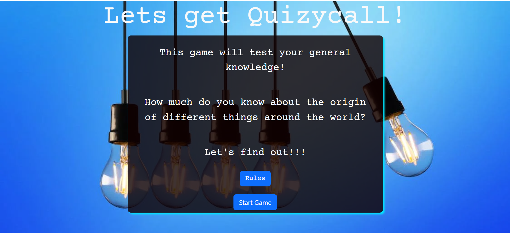
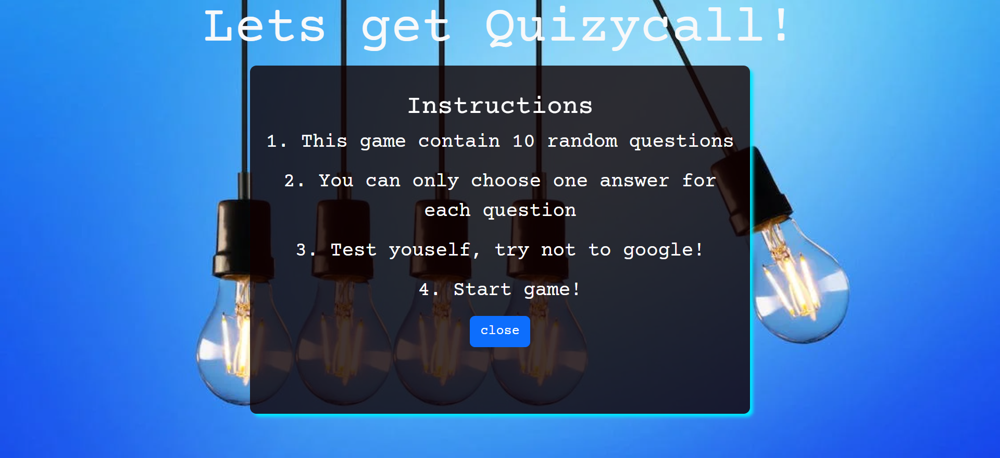
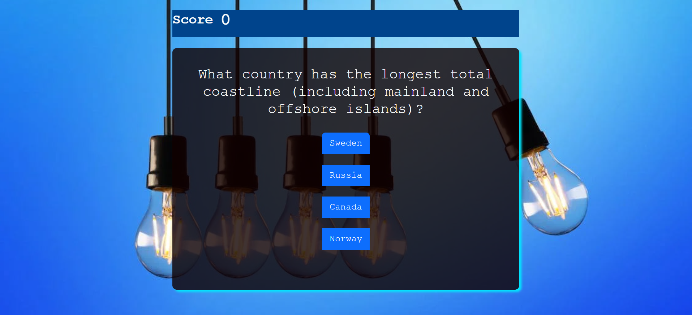

# Let's get quizycall 
(Developer Hope Tracy Njoroge)

let's get quizycall is an game targeted towards people who love to satisfy their quest for knwoledge. It aims to educate and entertain its users through the questions asked within the quiz.

[Visit the Let's get quizycall here]()

 

## Table of Content 

1. [Project Goals](#project-goals)
    - [Site Owner Goals](#site-owner-goal)
    - [User Goals](#user-goals)
2. [User Experience](#user-experience)
    - [Target Audience](#target-audience)
    - [User Stories](#user-stories)   
3. [Design](#design)
    - [Colour](#colour)
    - [Typography](#typography)
    - [Wireframes](#wireframes)
4. [Features](#features)
5. [Testing](#testing)
    - [Function Testing](#function-testing)
    - [Performance](#perfomance)
    - [Validation](#validation)
    - [HTML](#HTML)
    - [CSS](#CSS)
    - [JS](#JAVASCRIPT)
    - [Browser Compatibility](#browser-compatibility)
    - [Bugs](#bugs)
6.  [Version Control](#version-control)
7.  [Deployment](#deployment)
8.  [Credits](#credits)
9.  [Acknowledgements](#acknowledgements)

 

## Project Goals

Let's get quizycall is a quiz website created in partial fulfilment with the second milestone project for Code Institute's Full Stack Software Development course. It was developed out of curiosity to test if people are aware of the history and geography beyond the space they occupy. It tests how much knowledge people have about different parts of the world. 

### Site Owner Goals 
- Test users knowledge on world geography and history
- Provide questions and answers for the users
- Show rules of the game
- Show users results once quiz is done
- Display score as users play
- Display the correct and wrong answers when user plays game

### User Goals
- Easily navigate through the game
- Understand the rules of the game
- Get questions upon starting the game
- See correct and wrong answers while playing the game
- See score while playing the game and upon completion of the game

## User Experience

### Target Audience 
- People who are curious to satisfy their knowledge
- People seeking to engage in a new activity
- People seeking to entertain and educate themselves 

### User Stories 

#### First-time User

As a first-time visitor I want to:

1. See rules of the game
2. Start game
3. See correct answer and wrong answer after answering
4. See score as I play the game
5. Easily navigate through the website

#### Returning User 

As a returning-user I want to:

1. Easily navigate through the website
2. Easily share the website  with people

## Design 

### Colour 

This website uses a palette of pastel colours that are subtle yet eye catching to attract and keep users in the website. This palette was created using [Colorhunt]() website

 

### Typography 

[Google Fonts]() was used to source the font styles used throughout the website:
- Courrier Prime: Used for the logo and all headings
- Courrier Prime: Used for main body text

These fonts were chosen to be in order to give the website a simple and clean look. They were also chosen to ensure accessibility and readability 

 

### Wireframes 

Wireframes were created using [Balsamiq Wireframing Software](https:/balsamiq.com/)

View wireframes [PDF file here]()

## Features 

This website consists of a homepage, rules page, quizpage and endgame page.

### Background Image

- Background image for the website

### Game container

### Rules

### Quiz area

### Score Area

 

## Technology Used

This website has been written using HTML, CSS, BOOTSTRAP & JAVASCRIPT

 

### Frameworks, Libraries and Programs Used
- Github: Storing and hosting my code/repository
- Gitpod: Code editor for writing my code and storing other images/files
- Bootstrap: creating the modal and the buttons
- Colorhunt: For choosing the palette to be used in the website
- Google Fonts: To import the fonts used throughout the site
- Google DevTools: Used throughout the site's creation to test responsiveness and adjust layout
- Balsamiq: Wireframe software
- Am I Responsive: To create a visual of the website across different device sizes
- Tinypng: resize images 
- [Pexels](https://www.pexels.com/) For images used in the website
- [YouTube](https://www.youtube.com/) For inspiration and coding tutorials
- [W3schools](https://www.w3schools.com/) For coding questions and reference
- [Freecodecamp](https://www.freecodecamp.org/) For coding questions and reference
- [Lighthouse](https://developers.google.com/web) To test performance of website

 

## Testing 

Testing was performed across a range of devices, including:
- Lenovo ThinkVision T24i-20 (1920 x 1080)
- Dell XPS 9315 (1920 x 1200)
- HP Envy (1920 x 1080)
- Iphone 13 pro
- Iphone SE 2020

### Function Testing 

| Page | Test | Completed |
| :--- | :--- | :-------- |
| All  | Logo links back to homepage | Yes | 
| All  | Buttons direct to relevant pages | Yes |
| Homepage | Images and texts are responsive | Yes |
| Score | Increements on playing games | Yes |
| Answers  | Buttons change color upon answering question | Yes |
          

 

### Performance 
  
The website performance was tested using [Lighthouse](https://developers.google.com/web)

For Desktops:

Startpage

Rulespage

Gamespace

Score-area

 

For Mobile Devices

### Validation

### HTML

Startpage

Gamespace

Score-area

 [W3C Markup Validator](https://validator.w3.org/nu/) - validation service used. 

Startpage

Game-space

 

### CSS

 [W3C CSS Validator](https://jigsaw.w3.org/css-validator/#validate_by_address)  - validation service used. 

 

Stylesheet

### Browser Compatibility

Website was tested manually on these browsers: Google Chrome, Edge, Firefox, Safari. The results were satisfactory.

### Bugs

 

## Version Control

Version control has been maintained using Git. The code written for this website has been updated via regular commits to Github. These serve as a record of development and changes to the varying pages of html and css.

View commit history [here]()

 

## Deployment

Website was deployed on Github:

1. Log in to GitHub and locate the [GitHub Repository 
foodies-corner]()
2. Go to "Settings" Button on the menu.
3. Scroll down the Settings page until you locate the "Pages" in "Code and automation" section.
4. Under "Source", click the dropdown called "Select branch:" and select "Main", click the dropdown called "Select folder" and select "/root".
5. The page will automatically refresh and you receive message "Your site is published at". 

 

## Credits

### Code

- Code Institute README.md template has been used to create this document
- [YouTube]() 
- [W3schools]() 
- [FreeCodeCamp]()  
- [CSS Tricks]()

### Media

 Images were sourced from [Pexels.com](https://pexels.com/):
 - [Photo by hasan kurt from Pexels:]()

  

 ## Acknowledgements 

 - My Mentor Mitko Bachvarov for the helpul guidance, resources and feedback offered thoughout my project
 - Code Institute Slack community for the resourceful information and resources
 - Code Institute Tutor Support for being very generous with assitance and guidance in some areas in my project
 